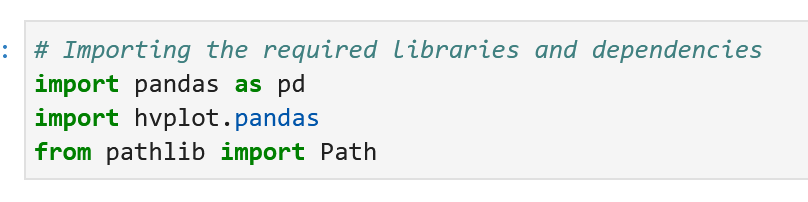

# San Francisco Housing

The main goal of this project is to find properties in the San Francisco market that are viable investment opportunity in order to provide people an instant, one-click service to buy properties and then rent them.


---

## Technologies

For this project we use Jupyter notebook in PyViz ecosystem for making visualizations in Python.


* [JupyterLab](https://github.com/jupyterlab/jupyterlab) - an extensible environment for interactive and reproducible computing, based on the Jupyter Notebook and Architecture

Libraries need for this project:


* [pandas](https://github.com/pandas-dev/pandas) - is a Python package that provides fast, flexible, and expressive data structures designed to make working with "relational" or "labeled" data both easy and intuitive 

* [hvplot](https://hvplot.holoviz.org/) - hvPlot provides an alternative for the static plotting API provided by Pandas and other libraries

* [pathlib](https://stackabuse.com/introduction-to-the-python-pathlib-module/) - provides a more readable and easier way to build up paths by representing filesystem paths as proper objects and enables us to write code that is portable across platforms

---

## Instalation Guide

Before opening the Jupyter notebook, you need to install:

With conda:

```python
conda install -c pyviz hvplot geiviews
```

---

## Contributors

Author: Magdalena Svimberska
email: magdalena.svimberska@gmail.com

---

## License

GNU General Public License